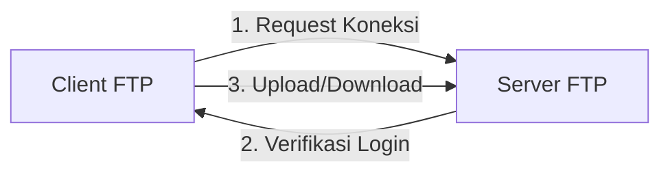

# File Transfer Protocol (FTP)  
*FTP (File Transfer Protocol) adalah protokol jaringan untuk transfer file antara client dan server melalui port 21 (FTP), 22 (SFTP), atau 990 (FTPS). Digunakan untuk upload, download, dan manajemen file di server remote. FTP dasar tidak terenkripsi, sedangkan SFTP/FTPS lebih aman dengan enkripsi. Contoh tools: FileZilla (GUI) dan library Python (ftplib, paramiko).*  

## 📌 **Pengertian FTP**  
**File Transfer Protocol (FTP)** adalah protokol jaringan yang digunakan untuk:  
- Transfer file antara *client* dan *server* (upload/download).  
- Mengelola file/direktori di server remote.  
- Beroperasi di **port 21** (FTP), **port 22** (SFTP/SSH), atau **port 990** (FTPS).  

## 🔧 **Kegunaan FTP**  
1. **Upload/Download File**  
   - Contoh: Mengunggah file website ke hosting.  
2. **Manajemen File Server**  
   - Buat/hapus file, rename, ubah permission.  
3. **Backup Data**  
   - Simpan cadangan data di server cloud.  

## 📡 **Jenis-Jenis FTP**  
| Jenis       | Port  | Enkripsi | Contoh Penggunaan          |  
|-------------|-------|----------|----------------------------|  
| **FTP**     | 21    | ❌ Tidak | Latihan mahasiswa           |  
| **FTPS**    | 990   | ✅ SSL   | Transfer file perusahaan    |  
| **SFTP**    | 22    | ✅ SSH   | Server Linux (aman)         |  

## 🔄 **Cara Kerja FTP**  


## **Code 1. Python Modul Paramiko**

```python
import paramiko

# Konfigurasi FTP
# Ubah host, username dan password menyesuaikan
host = "dlptest.com"
port = 22
username = "dlpuser"
password = "rNrKYTX9g7z3RgJRmxWuGHbeu"

try:
    # Buat koneksi SSH/SFTP
    ssh = paramiko.SSHClient()
    ssh.set_missing_host_key_policy(paramiko.AutoAddPolicy())
    ssh.connect(host, port, username, password)
    
    # Buka session SFTP
    sftp = ssh.open_sftp()
    
    # List file di direktori root
    print("Daftar file (SFTP):")
    files = sftp.listdir()
    for file in files:
        print(file)
    
    # Tutup koneksi
    sftp.close()
    ssh.close()

except Exception as e:
    print(f"Error: {e}")

```


## **Code 2. Python Modul Netmiko**

```python
from netmiko import ConnectHandler

# Ubah host, username dan password menyesuaikan
# Konfigurasi device (SSH/SFTP)

device = {
    "device_type": "linux",
    "host": "dlptest.com",
    "port": 22,
    "username": "dlpuser",
    "password": "rNrKYTX9g7z3RgJRmxWuGHbeu",
}

try:
    # Buat koneksi SSH
    ssh_conn = ConnectHandler(**device)
    
    # Eksekusi command Linux untuk list file
    output = ssh_conn.send_command("ls -l")
    print("Daftar file (via Netmiko SSH):")
    print(output)
    
    # Tutup koneksi
    ssh_conn.disconnect()

except Exception as e:
    print(f"Error: {e}")

```


## **Code 3. Python Modul FTP**

```python

from ftplib import FTP

# Konfigurasi server FTP
# ftp_server = "dlptest.com"
# ftp_username = "dlpuser"
# ftp_password = "rNrKYTX9g7z3RgJRmxWuGHbeu"

ftp_server = "ftp.dlptest.com"
ftp_username = "dlpuser"
ftp_password = "rNrKYTX9g7z3RgJRmxWuGHbeu"

# Membuat koneksi FTP
try:
    with FTP(ftp_server) as ftp:
        ftp.login(user=ftp_username, passwd=ftp_password)
        print("Berhasil terhubung ke FTP server!")
        
        # Menampilkan daftar file/direktori
        print("\nDaftar file di direktori root:")
        ftp.dir()  # Menampilkan list file (format panjang)
        
        # Alternatif: Ambil list file (hanya nama)
        print("\nNama file/folder:")
        files = ftp.nlst()  # Hanya list nama file
        for file in files:
            print(file)

except Exception as e:
    print(f"Error: {e}")

```

## **Code 4. Python UPLOAD/DOWNLOAD File**

```python
from ftplib import FTP

# Konfigurasi server FTP

ftp_server = "172.16.85.175"
ftp_username = "infra2"
ftp_password = "1232"

# File yang akan diupload (sesuaikan path-nya)
# file_to_upload = "local_file.txt"
# File yang akan didownload
file_to_download = "INFRA2_file_ikhwan.txt"

try:
    with FTP(ftp_server) as ftp:
        ftp.login(user=ftp_username, passwd=ftp_password)
        print("Berhasil terhubung ke FTP server!")
        
        # Menampilkan daftar file sebelum operasi
        print("\nDaftar file sebelum operasi:")
        ftp.dir()
        
        # # 1. Upload file ke server
        # print(f"\nMengupload file {file_to_upload}...")
        # with open(file_to_upload, 'rb') as file:
        #     ftp.storbinary(f'STOR {file_to_upload}', file)
        # print("Upload berhasil!")
        
        # 2. Download file dari server
        print(f"\nMendownload file {file_to_download}...")
        with open(file_to_download, 'wb') as file:
            ftp.retrbinary(f'RETR {file_to_download}', file.write)
        print(f"Download berhasil! Disimpan sebagai {file_to_download}")
        
        # Menampilkan daftar file setelah operasi
        print("\nDaftar file setelah operasi:")
        ftp.dir()

except Exception as e:
    print(f"Error: {e}")

```


***
by: ikhwan@fedora.linux 

